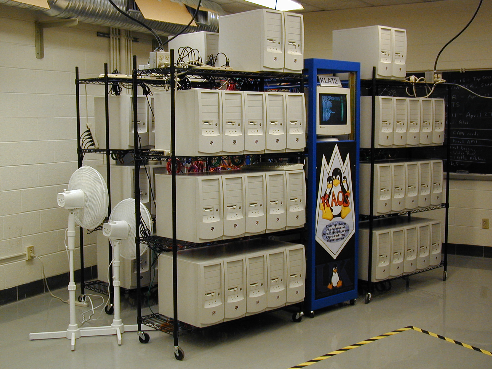

# Overview

In this exercise, we will learn about Kubernetes and install a local kubernetes cluster. 

# Kubernetes (k8s)

## History
Started as Borg project at Google in 2003-2004 as a distributed system that schedules workloads among physical commodity hardware. 

In 2010 Docker is announced as a way to isolate running processes.

In 2013 engineers that worked on Borg annnounce Kubernetes. 

## Building blocks

### Cluster
A Kubernetes cluster is a set of nodes that run containerized applications. 

img from http://aggregate.org/KLAT2/

### Node
A virtual or physical machine. Kubernetes runs workloads by grouping them across nodes. 

### Workload
A workload is an application running on Kubernetes. Usually a bunch of containers grouped together with some persistence resources. 

### Namespace
Namespaces provide a mechanism for isolating groups of resources within a cluster. 

### Pods and containers
Your workload is usually represented by a bunch of Pods. Each `Pod`, in turn, is a bunch of containers logically grouped together. Pods are by default stateless and it's a workload's (of type `StatefulSet`) responsibility to have state.

Note that the picture above is actually deceving because K8s was from the beginning created with the Cloud in mind. But it's a good way to think about `Cluster -> Node -> Pod -> Container` computational hierarcy.

See https://kubernetes.io/docs/concepts/ for more.

# Installing the tools
1. Install Docker https://www.docker.com/ You can use Docker Desktop or use any command line option that you like.

2. The easiest way to get started is to deploy a local Kubernetes cluster using `minikube`. Install minikube: https://minikube.sigs.k8s.io/docs/start/

