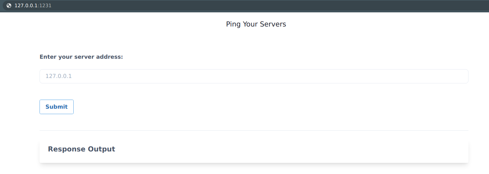

# ⎈ DIND (docker-in-docker) exploitation

## 🙌 Overview

In this scenario, we will be focusing on the common and standard ways how to build systems and pipelines that leverage container sockets to create, build and run containers from the underlying container runtime. This has been exploited since the early days of the container ecosystem and even today we see these misconfigurations/use cases in the real world. 

By the end of the scenario, we will understand and learn the following

1. You will learn to test and exploit the container UNIX socket misconfigurations
2. Able to exploit container and escape out of the docker container
3. Learn common misconfigurations in pipelines and CI/CD build systems

### ⚡️ The story

Most of the CI/CD and pipeline systems use the underlying host container runtime to build containers for you within the pipeline by using something called DIND (docker-in-docker) with a UNIX socket. Here in this scenario, we try to exploit this misconfiguration and gain access to the host system of the worker node by escaping out of the docker container.

:::info

- To get started with the scenario, navigate to [http://127.0.0.1:1231](http://127.0.0.1:1231)

:::

### 🎯 Goal

The goal of this scenario is to escape out of the running docker container to the host system where the container is running and able to access and perform actions on other container running on the same node.

:::tip

If you are able to obtain container images in the host system then you have completed this scenario. But definitely, you can advance beyond this exploitation as well by performing post-exploitation.

:::

### 🪄 Hints & Spoilers

  
<b>✨ Do you know how to run multiple commands in Linux? </b>

  

    
The application running here has command injection vulnerability. You can exploit this by using the <b>;</b> delimiter when passing the input 🙌

  

  
<b>✨ Able to run system commands, not sure how to access containers? </b>

  

    
Identify the mounted UNIX socket volume, and use the crictl binary to communicate with that with <b>-r</b> flag 🎉

  

