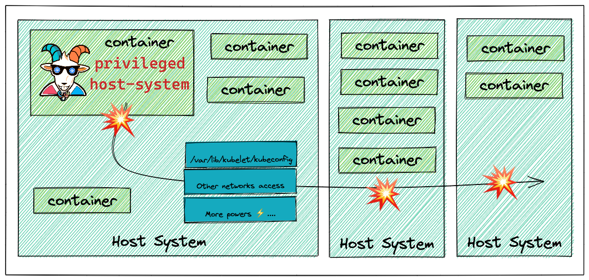

# ⎈ Container escape to the host system

## 🙌 Overview

This scenario showcases the common misconfigurations and one of the error-prone security issues in Kubernetes, container environments, and the general security world. Giving privileges that are not required for things always makes security worse. This is especially true in the containers and Kubernetes world. You can also apply this scenario further and beyond the container to other systems and services based on the configuration and setup of the cluster environments and resources. In this scenario you will see a privileged container escape to gain access to the host system.

By the end of the scenario, you will understand and learn the following:

1. Able to exploit the container and escape out of the docker container
2. You will learn to test and exploit the misconfigured and privileged containers
3. Learn about common misconfigurations and possible damage due to them for the containers, Kubernetes, and clusterized environments

### ⚡️ The story

Most of the monitoring, tracing, and debugging software requires extra privileges and capabilities to run. In this scenario, you will see a pod with extra capabilities and privileges including HostPath allowing you to gain access to the host system and provide Node level configuration to gain complete cluster compromise.

:::info

To get started with the scenario, navigate to [http://127.0.0.1:1233](http://127.0.0.1:1233)

:::

### 🎯 Goals

The goal of this scenario is to escape out of the running docker container on the host system using the available misconfigurations. The secondary goal is to use the host system-level access to gain other resources access and if possible even go beyond this container, node, and cluster-level access.

:::tip

Gain access to the host system and obtain the node level kubeconfig file `/var/lib/kubelet/kubeconfig`, and query the Kubernetes nodes using the obtained configuration.

:::

### 🪄 Hints & Spoilers

  
<b>✨ Are you still in the container? </b>

  

    
See the mounted file systems, also look the capabilities available for the container using <b>capsh</b> 🙌

  

  
<b>✨ Escaped container? </b>

  

    
You can recon the system, some interesting places to obtain the node level configuration are <b>/var/lib/kubelet/kubeconfig</b> and I hope you know how to query Kubernetes API for nodes? 🎉

  

## 🔖 References

- [Realworld case study of exploiting cap_sys_ptrace capability](https://madhuakula.com/content/attacking-and-auditing-docker-containers-using-opensource/attacking-docker-containers/capability.html)
- [Abusing Privileged and Unprivileged Linux Containers - NCC Group Whitepaper](https://www.nccgroup.com/globalassets/our-research/us/whitepapers/2016/june/container_whitepaper.pdf)
- [Understanding and Hardening Linux Containers - NCC Group Whitepaper](https://research.nccgroup.com/wp-content/uploads/2020/07/ncc_group_understanding_hardening_linux_containers-1-1.pdf)
