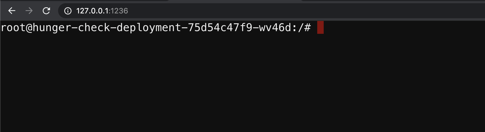

# ⎈ DoS the Memory/CPU resources

## 🙌 Overview

Availability is one of the triads in CIA. One of the core problems solved by Kubernetes is the management of the resources like autoscaling, rollouts, etc. In this scenario, we will see how attackers can leverage and gain access to more resources or cause an impact on the availability of the resources by performing the DoS (Denial of Service) if there were no resource management configurations implemented on the cluster resources like memory and CPU requests and limits.

By the end of the scenario, we will understand and learn the following

1. Learn to perform the DoS on computing and memory resources using `stress-ng`
2. Understand the Kubernetes resources management for pods and containers
3. Explore the Kubernetes resource monitoring using the metrics and information 

### ⚡️ The story

There is no specification of resources in the Kubernetes manifests and no applied limit ranges for the containers. As an attacker, we can consume all the resources where the pod/deployment running and starve other resources and cause a DoS for the environment.

:::info

To get started with the scenario, navigate to [http://127.0.0.1:1236](http://127.0.0.1:1236)

:::

### 🎯 Goal

:::tip

Access more resources than intended for this pod/container by consuming 2GB of memory to successfully complete the scenario.

:::

### 🪄 Hints & Spoilers

  
<b>✨ How can I DoS resources? </b>

  

    
You can leverage the popular command line utility like <b>stress-ng</b> 🙌

  

## 🔖 References

- [Resource Management for Pods and Containers](https://kubernetes.io/docs/concepts/configuration/manage-resources-containers)
