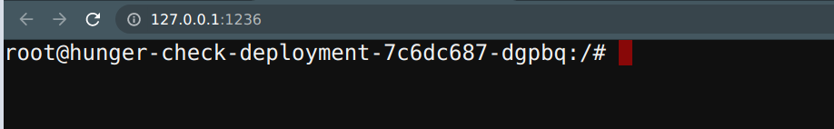

# ⎈ RBAC least privileges misconfiguration

## 🙌 Overview

In the early days of Kubernetes, there is no such concept as RBAC (role-based access control) and mostly it uses ABAC (attribute-based access control). Now it has superpowers like RBAC to implement the security principle of least privilege. Still, most of the real-world workloads and resources end up having wider privileges than it is intended to have. In this scenario, we will see how simple misconfiguration like this can gain access to secrets, more resources, and information.

By the end of the scenario, we will understand and learn the following

1. Accessing and talking to the Kubernetes API Server using the REST API
2. Working with different Kubernetes resources and querying them
3. Exploiting the misconfigured/overly permissive permissions to gain access to sensitive information and resources

### ⚡️ The story

We commonly see in the real world where developers and DevOps teams tend to provide extra privileges than required. This provides attackers more control and privileges than they intended to be. In this scenario, you can leverage the service account bound to the pod to provide `webhookapikey` access, but using this attacker can gain control over other secrets and resources.

:::info

To get started with the scenario, navigate to [http://127.0.0.1:1236](http://127.0.0.1:1236)

:::

### 🎯 Goal

:::tip

Find the `k8s_goat_flag` flag value by gaining access to the Kubernetes secret `k8svaultapikey` by exploiting the RBAC privileges to complete this scenario.

:::

### 🪄 Hints & Spoilers

  
<b>✨ Not sure where the ServiceAccount in k8s pod? </b>

  

    
Simple googling and looking at docs can show that you can get service account details avaiolable in pod at <b>/var/run/secrets/kubernetes.io/serviceaccount/</b> 🙌

  

  
<b>✨ Stuck at querying the API Server? </b>

  

    
Again look at docs here as well. To save your time, here you go <a href="https://kubernetes.io/docs/tasks/run-application/access-api-from-pod/">Accessing the Kubernetes API from a Pod</a>. Have fun 🎉

  

## 🔖 References

- [RBAC Authorization Kubernetes](https://kubernetes.io/docs/reference/access-authn-authz/rbac/)
- [Accessing the Kubernetes API from a Pod](https://kubernetes.io/docs/tasks/run-application/access-api-from-pod/)
- [More misconfigurations in Kubernetes? check OWASP WrongSecrets](https://github.com/OWASP/wrongsecrets)
