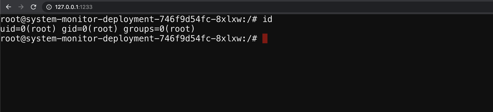

# ⎈ Gaining environment information

## 🙌 Overview

This is no different from the traditional workloads. Most of the compute instances while running the applications store sensitive information like secrets, api_keys, etc. in the environment variables. Similarly, in Kubernetes, most of the people store sensitive information like Kubernetes Secrets and the Config values in the environment variables and if an attacker can find application vulnerabilities like RCE(remote code execution) or command injection then it's game over for that secret.

By the end of the scenario, we will understand and learn the following

1. How to explore the environment variables and analyze
2. Gaining access to sensitive information in the container

### ⚡️ The story

Each environment in Kubernetes will have a lot of information to share. Some of the key things include secrets, API keys, configs, services, and a lot more. So let's go ahead and find the vault key!

:::info

To get started with the scenario, navigate to [http://127.0.0.1:1233](http://127.0.0.1:1233)

:::

### 🎯 Goal

:::tip

Get the `k8s_goat_flag` flag value then you have completed this scenario. This can be found in multiple ways!

:::

### 🪄 Hints & Spoilers

  
<b>✨ Not sure where the environment variables get stored? </b>

  

    
Let me take back you to the standard linux utilites and commands like env 🙌

  

## 🔖 References

- [Kubernetes Secrets](https://kubernetes.io/docs/concepts/configuration/secret/)
- [Injecting Secrets into Kubernetes Pods via Vault Agent Containers](https://learn.hashicorp.com/tutorials/vault/kubernetes-sidecar)
